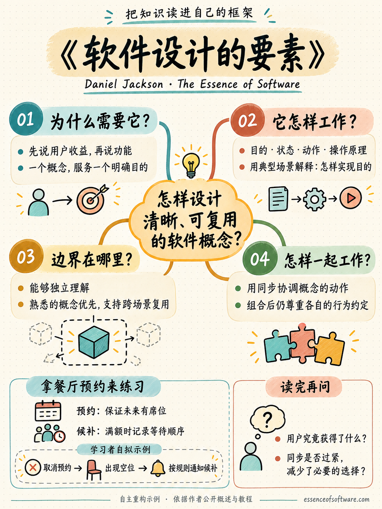

# concept-skills

[](https://skills.sh/ontology-of-everything/concept-skills)

> 先说清含义，再写代码、跑命令、起草规格。

[concept-skills](https://github.com/ontology-of-everything/concept-skills)
提供 9 项能力、18 个中英文
[Agent Skills](https://agentskills.io/)，覆盖本体与语义层和概念设计。英文使用基础名，简体中文统一增加
`-cn`。

Cloud 操作类技能现已迁移到
[`concept-git/cloud-concept-skills`](https://github.com/concept-git/cloud-concept-skills)，本仓库不再分发。

办公类技能现已迁移到同级 `myoffice-skills` 仓库，本仓库不再分发。

概念设计几个技能改编自 Daniel Jackson 的 concepts 与 synchronizations 模型 ——
[The Essence of Software](https://essenceofsoftware.com/)（2021），sync 采用 _Beyond
Objects_（[arXiv:2606.27258](https://arxiv.org/abs/2606.27258)）里现行的 when/where/then 记法 —— 面向 Agent 改编，未获作者背书。

English: [README.md](README.md)。

当前版本为 **2.0.0**。原有 `software-concept-architect-*` 技能仅显式调用；`software-concept-architect-refine` 与 `read-it-reframe-it-own-it` 支持自动匹配；`software-concept-architect-guardrails` 只消费 Jackson 记法。

## 目录

- [技能](#技能)
- [安装](#安装)
- [用法](#用法)
- [经典使用案例](#经典使用案例)
- [贡献](#贡献)
- [更新日志](CHANGELOG.zh.md)
- [许可](#许可)

## 技能

<!-- skill-catalog:start -->

按主要解决的问题分类；系列名称用于展示。

### 概念设计

设计软件概念、职责、规格与实现。

| 技能 | 版本 | ClawHub 分类 |
| --- | --- | --- |
| [软件概念架构师 · 设计](docs/skills/cn/software-concept-architect-design-cn.md) | 1.0.0 | development |
| [软件概念架构师 · 需求规格](docs/skills/cn/software-concept-architect-prd-cn.md) | 1.0.0 | development |
| [软件概念架构师 · 实现](docs/skills/cn/software-concept-architect-build-cn.md) | 1.0.0 | development |
| [软件概念架构师 · 审查](docs/skills/cn/software-concept-architect-review-cn.md) | 1.0.0 | development |
| [软件概念架构师 · 规格护栏](docs/skills/cn/software-concept-architect-guardrails-cn.md) | 1.0.0 | development |
| [软件概念架构师 · 精炼](docs/skills/cn/software-concept-architect-refine-cn.md) | 1.0.0 | development |

### 语义建模

定义数据、事实、维度与关系的业务含义。

| 技能 | 版本 | ClawHub 分类 |
| --- | --- | --- |
| [数据知识架构师](docs/skills/cn/data-knowledge-architect-cn.md) | 1.1.0 | knowledge |

### 知识管理

从原文萃取、关联、组织和复用知识。

| 技能 | 版本 | ClawHub 分类 |
| --- | --- | --- |
| [个人知识架构师](docs/skills/cn/personal-knowledge-architect-cn.md) | 0.4.0 | knowledge |

### 学习方法

围绕学习目标与关键框架建立并修正理解。

| 技能 | 版本 | ClawHub 分类 |
| --- | --- | --- |
| [读它，重构它，化为己有](docs/skills/cn/read-it-reframe-it-own-it-cn.md) | 0.2.0 | knowledge（暂缓发布） |

<!-- skill-catalog:end -->

### 概念设计工作流

目的驱动的软件设计。基于 Daniel Jackson《The Essence of Software》的概念设计方法。

名称、展示标题与迁移记录见 [Software Concept Architect](docs/software-concept-architect-migration.md)。

从需求到模块，以概念模型为契约。每个技能停在自己的边界上交棒：`design` → `prd` / `build` →
`review`。

共同原则：同步可收窄行为，不可扩展概念契约；组合合法性与目的兑现分别检验。

对照实例：[餐厅预约](docs/examples/restaurant/cn/README.md)。同一场景、四套结构，以及复杂性计数。英文在 [Restaurant reserve](docs/examples/restaurant/en/README.md)。

技能详情与分类见 [docs/catalog.yml](docs/catalog.yml)，本地化规范见 [docs/localization.md](docs/localization.md)。

## 安装

需要 Node.js（用于 `npx`）。

基础名安装英文版；简体中文版统一使用 `-cn`。

ClawHub 只发布 `skills/en` 英文版；中文版继续通过 GitHub 安装。

```bash
npx skills add ontology-of-everything/concept-skills \
  --skill <skill-name> \
  --agent cursor \
  --copy -y
```

`--agent` 可填 `cursor`、`claude-code` 或 `codex`。一次装多个；加 `--global` 装到
`~/.agents/skills/`（Cursor 与 Codex 都会扫描），而不是项目的 `.agents/skills/`：

```bash
npx skills add ontology-of-everything/concept-skills \
  --skill software-concept-architect-design software-concept-architect-prd software-concept-architect-guardrails \
  --agent cursor codex \
  --global --copy -y
```

列出可装技能，或开发时从本地目录安装：

```bash
npx skills add ontology-of-everything/concept-skills --list
npx skills add ./skills/<skill-name> --skill <skill-name> --agent cursor --copy -y
```

收录：[skills.sh](https://skills.sh/ontology-of-everything/concept-skills)（分组见
[`skills.sh.json`](skills.sh.json)）·
[SkillsMP](https://skillsmp.com/)（仓库 topics：`claude-skills`、`claude-code-skill`）·
[ClawHub](https://clawhub.ai/)。

各 Agent 说明：[Cursor](docs/agents/cursor.md) · [Claude Code](docs/agents/claude-code.md) ·
[Codex](docs/agents/codex.md)。

使用前先读一遍技能内容——技能以你的 Agent 权限运行。

## 用法

技能通常按 description 自动触发，正常说话就够。概念设计工作流默认不启动，必须显式指名（Cursor
`/software-concept-architect-design`，Codex `$software-concept-architect-design`）：

```text
$software-concept-architect-design-cn 把这个需求建成概念模型
$software-concept-architect-prd-cn 模型定了，出一份 PRD 规格
$software-concept-architect-guardrails-cn concept src/orders
$software-concept-architect-guardrails-cn drift src/orders
把这套接口做成语义层                        → data-knowledge-architect-cn
```

要指名某个技能：Cursor 里用 `/skill-name`，Codex 里用 `$skill-name`。

## 经典使用案例

每项技能提供 3 条由浅入深的请求；每行可单独复制。先安装对应技能，再把“我提供的材料”换成实际附件、选中文本或文件；示例路径也需替换为项目真实路径。

### 读它，重构它，化为己有

`read-it-reframe-it-own-it-cn`

| 难度 | 案例 | 可复制的请求 |
| --- | --- | --- |
| 入门 | 读懂一个主题 | `$read-it-reframe-it-own-it-cn` 基于我提供的“概念独立性”节选，以“能判断两个功能是否应该分开”为学习目标，整理一棵简短知识树，每个分支配一个例子。 |
| 实用 | 生成一本书的知识树 | `$read-it-reframe-it-own-it-cn` 基于我提供的《软件设计的要素》材料，围绕“如何设计职责清晰、可组合的软件”确定关键框架，再把书中的观点、方法和案例融入知识树；区分原文依据与我的推论。 |
| 中等 | 把知识树画成学霸笔记图 | `$read-it-reframe-it-own-it-cn` 把刚才确认的《软件设计的要素》知识树整理成一张中文学霸笔记图。保留中心问题、关键分支、一个应用例子和复习问题；先确定图中文字，再调用可用的图片生成工具绘制。 |

第 3 条需搭配图片生成能力：本技能负责知识重构，绘图工具负责图片。可使用本仓库版本；该技能在 ClawHub 上暂缓发布。

### 个人知识架构师

`personal-knowledge-architect-cn`

| 难度 | 案例 | 可复制的请求 |
| --- | --- | --- |
| 入门 | 从笔记中找方法 | `$personal-knowledge-architect-cn` 从这组5篇用户访谈笔记中提取场景、方法概念和相关实体，先给出去重后的骨架及来源，供我确认。 |
| 实用 | 建立可复用的方法库 | `$personal-knowledge-architect-cn` 整理这10篇产品研究笔记，合并重复方法；骨架确认后，补全各方法的输入、处理、输出和适用场景，生成三类知识 YAML。 |
| 中等 | 连接跨主题知识 | `$personal-knowledge-architect-cn` 将这批访谈、需求分析和产品验证资料组织成可复用知识库。让“验证新产品需求”场景调用已提取的方法与工具，保留来源并检查引用关系。 |

### 数据知识架构师

`data-knowledge-architect-cn`

| 难度 | 案例 | 可复制的请求 |
| --- | --- | --- |
| 入门 | 解释一张订单表 | `$data-knowledge-architect-cn` 根据我提供的订单表 DDL 和字段说明，识别业务含义、事实粒度与候选维度和度量，把缺少依据的定义列为待确认。 |
| 实用 | 对齐接口与数据表 | `$data-knowledge-architect-cn` 根据订单 OpenAPI 和对应表结构建立语义模型；列出命名、状态与统计口径的冲突，通过决策工作台确认后输出 OKF。 |
| 中等 | 建模订单、支付与退款 | `$data-knowledge-architect-cn` 把订单、支付和退款接口建成一组关联的语义模型，明确各自粒度、共享维度与度量口径。先审查跨模型决策，确认后输出并校验 OKF bundles。 |

### 软件概念架构师 · 设计

`software-concept-architect-design-cn`

| 难度 | 案例 | 可复制的请求 |
| --- | --- | --- |
| 入门 | 设计待办清单 | `$software-concept-architect-design-cn` 为支持添加、完成和重新打开任务的待办清单做概念设计。先和我确认用户收益与概念边界，再写目的、状态、动作和操作原理。 |
| 实用 | 设计餐厅预约 | `$software-concept-architect-design-cn` 为支持预约与取消的餐厅系统做概念设计，明确应用目的、概念职责和同步规则，并用一个完整用餐预约场景检验设计。 |
| 中等 | 为预约系统增加候补 | `$software-concept-architect-design-cn` 在已确认的预约设计中增加“满额后候补、空位出现后通知”的需求。比较扩展已有概念与引入新概念的方案，确认后更新受影响的模型与同步规则。 |

### 软件概念架构师 · 需求规格

`software-concept-architect-prd-cn`

| 难度 | 案例 | 可复制的请求 |
| --- | --- | --- |
| 入门 | 把模型写成简明规格 | `$software-concept-architect-prd-cn` 把已确认的待办清单概念模型整理成简明 PRD，保留目的、状态、动作、操作原理与验收依据。 |
| 实用 | 交付预约系统规格 | `$software-concept-architect-prd-cn` 将已确认的餐厅预约模型写成总体 PRD、各概念的 CONCEPT.md 与 SYNCS.md，让验收条件能追溯到目的、场景或行为约定。 |
| 中等 | 增量更新候补规格 | `$software-concept-architect-prd-cn` 根据已确认的候补设计，只更新受影响的 PRD、概念规格、同步规则与验收条件，保留已有人工说明，并标记未决项。 |

### 软件概念架构师 · 实现

`software-concept-architect-build-cn`

| 难度 | 案例 | 可复制的请求 |
| --- | --- | --- |
| 入门 | 实现一个独立概念 | `$software-concept-architect-build-cn` 根据已确认的待办概念规格，用 TypeScript 实现一个内存存储模块，并测试添加、完成和重新打开任务的行为。 |
| 实用 | 实现预约与取消 | `$software-concept-architect-build-cn` 根据已确认的预约模型和规格实现 TypeScript 后端，保持概念模块独立，通过同步规则协调，并验证预约与取消场景。 |
| 中等 | 实现候补递补流程 | `$software-concept-architect-build-cn` 按已确认的候补规格实现“取消预约、释放空位、通知候补”的完整流程，测试正常路径及规格中定义的失败情况。 |

### 软件概念架构师 · 审查

`software-concept-architect-review-cn`

| 难度 | 案例 | 可复制的请求 |
| --- | --- | --- |
| 入门 | 审查一个概念设计 | `$software-concept-architect-review-cn` 只读审查这份待办概念模型：目的是否清楚，动作和操作原理是否能实现目的，哪些结论仍缺少证据？ |
| 实用 | 检查规格与代码偏差 | `$software-concept-architect-review-cn` 对照预约需求、概念规格和代码，检查重复预约、取消与名额释放是否符合约定，给出具体证据和问题优先级。 |
| 中等 | 审查新增候补后的整体行为 | `$software-concept-architect-review-cn` 审查增加候补后的系统：概念是否仍独立，同步是否违反契约，端到端场景是否满足应用目的，并检查原有预约流程是否受影响。 |

### 软件概念架构师 · 规格护栏

`software-concept-architect-guardrails-cn`

| 难度 | 案例 | 可复制的请求 |
| --- | --- | --- |
| 入门 | 盘点规格覆盖 | `$software-concept-architect-guardrails-cn` audit src/reservations 检查该模块缺少哪些概念规格或同步说明，只输出覆盖报告与建议命令。 |
| 实用 | 从代码补回契约 | `$software-concept-architect-guardrails-cn` concept src/reservations 根据现有代码补全 CONCEPT.md，区分可证实行为、推断的目的和已发现的设计缺口。 |
| 中等 | 检查一组模块的规格漂移 | `$software-concept-architect-guardrails-cn` drift src 对照预约与候补模块现有的 CONCEPT.md、SYNCS.md 和代码，输出规格漂移证据，不自动修改契约。 |

### 软件概念架构师 · 精炼

`software-concept-architect-refine-cn`

| 难度 | 案例 | 可复制的请求 |
| --- | --- | --- |
| 入门 | 精炼一个职责含混的概念 | `$software-concept-architect-refine-cn` 检查这个既管理任务完成状态、又负责提醒推送的 Todo 概念，结合使用场景判断职责是否过载，给出最小调整建议。 |
| 实用 | 判断相似概念是否应该合并 | `$software-concept-architect-refine-cn` 比较“收藏”和“稍后阅读”两个概念的目的与行为，判断应保持独立、统一还是特化，并说明收益与代价。 |
| 中等 | 精炼过载的预约模块 | `$software-concept-architect-refine-cn` 检查同时承担预约、支付、通知与候补职责的 Booking 模块，依据需求、规格和代码定位过载或同步问题，给出保留必要行为的最小重构方案。 |

**串联使用：** 设计并确认模型 → PRD → 实现 → 审查。已有项目可先运行 Guardrails audit，再根据问题补规格或精炼概念。

### 学霸笔记图示例

《软件设计的要素》（The Essence of Software）的学习示例：围绕“怎样设计清晰、可复用的软件概念？”建立框架，再生成笔记图。



本图是依据 Daniel Jackson 的[公开概述](https://essenceofsoftware.com/posts/distillation/)和[概念判据教程](https://essenceofsoftware.com/tutorials/concept-basics/criteria/)自主重构的演示；餐厅候补流程为学习者自拟例子。图片由内置 imagegen 生成，不是原书页面或全书摘要。[查看图片生成提示词](docs/examples/reading/essence-of-software-study-notes.prompt.txt)。

## 贡献

[docs/CONTRIBUTING.md](docs/CONTRIBUTING.md) · [docs/authoring.md](docs/authoring.md)

```bash
./tools/skill-scaffold.sh <skill-name>   # 新建技能
./tools/install-git-hooks.sh             # pre-commit → validate-all.sh
./tools/validate-all.sh                  # 全部技能，与 CI 一致
./qa/<skill-name>/validate.sh            # 单个技能
```

`skills/en/<name>/` 与 `skills/cn/<name>-cn/`
是自包含安装载荷；QA 按相同语言目录分层且不随安装分发。每次修改必须同步中英文、目录、文档和 parity 门禁。

## 许可

[Apache-2.0](LICENSE) © concept-skills contributors。发布到 [ClawHub](https://clawhub.ai/)
的技能包在该平台为 MIT-0；仓库源码仍为 Apache-2.0。
