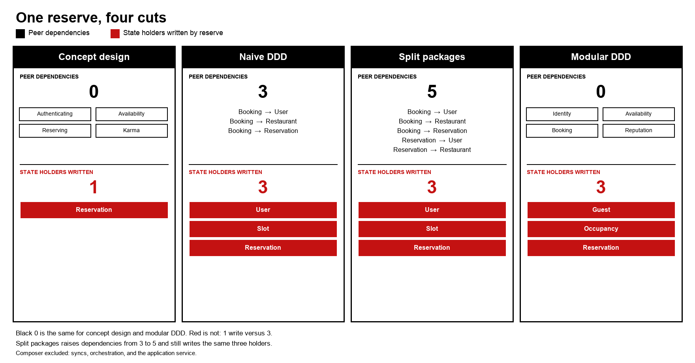

# 对照

场景与[概述](README.md)相同。四套 Rust 树是 `concept/`、`ddd-clean/`、`oop-packages/`、`ddd-modular/`。

| | 概念设计 | 朴素 DDD | 模块化 DDD |
| --- | --- | --- | --- |
| 模块 | Authenticating、Availability、Reserving、Karma，另加 syncs | User、Restaurant、Reservation，另加 `BookingService` | Identity、Availability、Booking、Reputation，另加编排 |
| 谁提交一次预约 | `Reserving::reserve` 插入一条预约 | `BookingService::reserve` 改用户、把时段标成占用、再建预约 | `BookingService::reserve` 改客人、占用时段、再建预约 |
| 数据库 | 每个概念一个 SQLite 文件，无跨概念外键 | 一个 SQLite 文件，表之间有外键 | 每个限界上下文一个 SQLite 文件 |
| Alice 之后 | Availability 仍列出该时段 | `Slot.reserved` 把它藏起来 | Availability 仍列出；占用记在 Booking |
| Bob | `Conflict` | `NoSlot` | `Conflict` |

`oop-packages/` 是朴素模型按名词拆成 crate。`reservation` 依赖 `user` 和 `restaurant`。搜索同样变空，Bob 同样得到 `NoSlot`。

## 复杂性指标

下表是适用于「模块怎么切」的已发表定义。每一项都在这四套树上核对过，或标明没有跑。

| 指标 | 定义 | 核对结果 |
| --- | --- | --- |
| 圈复杂度 | McCabe，1976。函数里的独立路径数。 | [lizard](https://github.com/terryyin/lizard) 1.24.0。领域函数不超过 10。四套树里冒出来的都是命令行循环，31 或 33。不画进图。 |
| 传出耦合 Ce | Martin，1994。本模块依赖的其他模块数。 | 行为模块之间的边：概念 0，朴素 DDD 3，分包 5，模块化 DDD 0。下图黑条。 |
| 累积组件依赖 CCD | Lakos，1996。每个组件算上自己，再加上它直接或间接依赖的组件，再把这些数加总。 | 算上组合根、去掉共享内核时，概念和模块化 DDD 是同一颗星：5 个组件，CCD 为 9。分包是 4 个组件，CCD 为 9。朴素 DDD 去掉组合根：4 个组件，CCD 为 7。不画进图。星形和对象图会落到同一个 CCD。 |
| 对象间耦合 CBO | Chidamber 与 Kemerer，1994。一个类用到的其他类。 | 不按 CBO 出图。红条更窄：reserve 成功路径写入的领域结构体个数。 |
| 信息流 | Henry 与 Kafura，1981。长度 ×（扇入 × 扇出）²。 | 未使用。扇出会把查询和写入混在一起。 |
| 认知复杂度 | Sonar 对嵌套控制流的计数。 | 未跑。这四套树没有 Sonar 扫描。 |
| Halstead 体积 | 运算符与操作数。 | 未跑。 |
| 代码行数 | 规模。tokei 的 Rust 代码列。 | 概念 1473，朴素 DDD 1096，分包 1088，模块化 DDD 1564。这是规模，不是复杂性。 |

黑条是行为模块之间的依赖。红条是一次 reserve 成功路径写入的状态持有者。图上的刻度是英文。

### 两个条怎么数

**模块间依赖**（黑）。行为模块是拥有领域状态或预订服务的 crate。单 crate 那套树里，它是 `domain/` 下的文件。一条边是对另一个行为模块的 `use`。共享内核、标识类型、SQLite 适配器和组合根不算进去。组合根是 `syncs`、模块化编排，以及朴素 DDD 的应用服务：它们本来就要调用被组合的模块。

| 树 | 边 |
| --- | --- |
| 概念 | Authenticating、Availability、Reserving、Karma 之间没有边。`syncs` 依赖这四个，这颗星是组合根，不计入黑条。 |
| 朴素 DDD | `domain/booking.rs` 使用 `user`、`restaurant`、`reservation`。这三个彼此不用。 |
| 分包 | `booking` 使用 `user`、`restaurant`、`reservation`。`reservation` 使用 `user` 和 `restaurant`。 |
| 模块化 DDD | Identity、Availability、Booking、Reputation 之间没有边。编排依赖这四个，按与 `syncs` 相同的规则排除。 |

**写入的状态持有者**（红）。reserve 成功路径上，字段被改动的领域结构体，加上该路径插入的预约。

| 树 | 成功路径 | 个数 |
| --- | --- | --- |
| 概念 | `Reserving::reserve` 插入一条 `Reservation`。`RestaurantSyncs::reserve` 读取其余三个概念，只通过这次调用写入。 | 1 |
| 朴素 DDD | `BookingService::reserve` 调用 `User.note_booked`，设置 `Slot.reserved`，并构造 `Reservation`。应用服务把三者都存回去。 | 3 |
| 分包 | 同一个函数，三个结构体在不同 crate 里。 | 3 |
| 模块化 DDD | `BookingService::reserve` 调用 `Guest.note_booked` 和 `SlotOccupancy.occupy`，并构造 `Reservation`。Booking 门面把三者都存回去。这条路径上，编排不写 Availability，也不写 Reputation。 | 3 |

圈复杂度用 lizard 1.24.0 读取，排除 `target/` 和 `main.rs`：

| 树 | 函数 | 平均 CCN | 领域函数最高 CCN | 命令行 `run` |
| --- | --- | --- | --- | --- |
| 概念 | 79 | 1.84 | 9，Availability 的一次 SQLite 读取 | 33 |
| 朴素 DDD | 51 | 2.45 | 10，`get_restaurant` | 31 |
| 分包 | 50 | 2.58 | 10，`get_restaurant` | 31 |
| 模块化 DDD | 88 | 1.90 | 9，Availability 的一次 SQLite 读取 | 33 |

领域函数里最高的是行映射。它们分不开这几套切法。黑条分开的是对象图，以及两个行为模块互不引用的切法。红条分开的是只写一个结构体的 Reserving，以及两个都写三个结构体的 DDD 服务。
